# WorkConnect

## Transformamos pequeños proyectos en experiencia profesional real

**Work Connect** es una plataforma impulsada por **inteligencia artificial** que conecta **pequeños negocios** que necesitan soluciones digitales accesibles con **jóvenes** que necesitan construir **experiencia profesional verificable**.

No es solo otro marketplace freelance: democratiza la **primera oportunidad laboral** y baja la barrera técnica de las PYMEs. El empresario explica su problema en lenguaje cotidiano; la IA genera un requerimiento con **objetivo, tipo de solución, tecnologías, tiempo estimado, alcance y dificultad**; el talento postula, entrega y acumula **portafolio, reputación y perfil público con QR**.

**Índice:** [El problema](#el-problema) · [Cómo funciona](#cómo-funciona) · [MVP vs roadmap](#mvp-implementado-vs-roadmap) · [Módulos](#módulos-de-la-plataforma-m118) · [Inicio rápido](#inicio-rápido) · [Manual de usuario](#manual-de-usuario) · [Casos de uso](#diagrama-de-casos-de-uso) · [API](#api-rest)

---

## El problema

Existen dos crisis conectadas: **jóvenes sin experiencia** y **pequeños negocios sin acceso digital asequible**.

### Jóvenes con talento, sin puerta de entrada

Muchos desarrollan habilidades reales (programación, diseño, marketing, video) de forma autodidacta o en cursos, incluso con proyectos personales. Al buscar empleo chocan con la misma barrera: **“necesitas experiencia”**. Las empresas exigen trayectoria y entregas verificables; sin la **primera oportunidad** no pueden construirla. Además, a menudo **no conocen los problemas reales** de las PYMEs: dominan la herramienta, no el contexto del negocio.

### Pequeños negocios: necesidad, sin presupuesto ni lenguaje técnico

Miles de emprendimientos necesitan web, catálogo, redes, diseño o automatizaciones básicas, pero **no pueden pagar** agencias ni perfiles senior. Y **no saben plantear técnicamente** lo que necesitan: saben el problema de negocio, no si requieren landing, tienda virtual o solo presencia en redes.

**Ejemplo:** un empresario de papas en Barranquilla quiere “vender más”. Tal vez necesita una landing con catálogo y WhatsApp — no una app enterprise — pero no puede traducirlo a un requerimiento que un desarrollador junior entienda.

### Puente WorkConnect

| Empresario | Plataforma | Talento joven |
|------------|------------|---------------|
| “Tengo 200.000 pesos y necesito X” | IA → requerimiento estructurado | Ve proyectos reales con presupuesto |
| Publica sin saber redactar specs | Matching por skills | Postula con precio y plazo |
| Elige postulación | Mensajes + reseñas | Entrega → experiencia y rating |
| Obtiene su producto | — | Perfil público + **QR** en ferias |

---

## Cómo funciona

1. **El empresario publica** qué problema tiene, qué quiere lograr y **cuánto puede invertir** (COP o USD).  
   *Ejemplo: “Tengo 200.000 pesos y necesito una página sencilla para mostrar mis productos.”*

2. **La IA convierte** la necesidad en proyecto técnico: objetivo, tipo de solución, tecnologías (WordPress, Laravel, React…), alcance, tiempo estimado, dificultad y presupuesto formateado.

3. **El joven explora** el marketplace, ve **% de compatibilidad**, filtra y postula; la IA puede **mejorar su propuesta** y envía su hoja de vida (skills, trust score).

4. **La empresa elige** talento en Mis proyectos (aceptar / rechazar) y se comunica por mensajes.

5. **Cada proyecto suma trayectoria:** reseñas, portafolio y perfil `/talento/{username}` con **QR** para reclutadores. Diez proyectos reales valen más que diez cursos en el CV.

### Valor diferencial

| Para el negocio | Para el joven |
|-----------------|---------------|
| Solución digital a bajo costo | Primera experiencia acotada |
| No redacta brief técnico | Aprende problemas reales del mercado |
| IA sugiere stack adecuado | Matching: no pierde tiempo en lo imposible |
| Talento joven motivado | Portafolio + reputación + QR |

### Inteligencia artificial

1. Estructurar necesidades → proyectos publicables  
2. Recomendar tecnologías según alcance  
3. Matching perfil ↔ proyecto  
4. Mejorar propuestas de postulación  
5. Analizar perfil y sugerir mejoras  
6. Recomendar trabajos al talento  

Sin API key externa (Gemini/OpenAI), el brief y el matching funcionan con **lógica local en español**.

### Flujo técnico (resumen)

```
Empresa: necesidad + presupuesto → IA (structure-project) → POST /jobs
Jóvenes: GET /jobs (filtros, match %) → POST /apply
Empresa: GET /my-jobs/{id}/applications → PATCH aceptar/rechazar
Trayectoria: reseñas + perfil público + QR
```

---

## MVP implementado vs roadmap

| Capacidad | Estado |
|-----------|--------|
| Registro por rol (empresa / talento / admin) | ✅ |
| IA: necesidad → brief (COP/USD, tech stack, tiempo, dificultad) | ✅ |
| Publicar, explorar, postular, aceptar/rechazar | ✅ |
| Matching %, mejorar propuesta con IA | ✅ |
| Perfil público `/talento/{username}` + QR | ✅ |
| Mensajes, notificaciones, reseñas (API) | ✅ básico |
| Workspace (entregas, tareas, archivos) | 🔜 planificado |
| Pagos / escrow | 🔜 planificado |
| Estados entrega → pagado | 🔜 parcial |
| Matching automático “mejor candidato” | 🔜 parcial |
| Filtros por sector, CV exportable, métricas universidades | 🔜 planificado |

---

## Módulos de la plataforma (M1–M18)

| Código | Módulo | Estado | Descripción |
|--------|--------|--------|-------------|
| M1 | Identidad y acceso | ✅ MVP | Registro, login, reset password, correo bienvenida |
| M2 | Perfiles y habilidades | ✅ MVP | Bio, skills, avatar (`/dashboard/profile`) |
| M3 | Solicitud empresa (necesidad cruda) | ✅ MVP | `/dashboard/publish` |
| M4 | IA → requerimiento | ✅ MVP | `POST /api/ai/structure-project` |
| M5 | Marketplace micro-proyectos | ✅ MVP | `GET /jobs`, explore |
| M6 | Matching | ✅ MVP | `match-job`, `recommend-jobs`, % en explore |
| M7 | Postulación y propuesta | ✅ MVP | apply + `improve-proposal` |
| M8 | Selección de talento | ✅ MVP | `PATCH /applications/{id}` |
| M9 | Ejecución y entrega | 🔜 | Estados entrega → cierre |
| M10 | Reputación y reseñas | ⚡ parcial | API lista; UI post-entrega pendiente |
| M11 | Mensajería | ✅ MVP | `/dashboard/messages` |
| M12 | Notificaciones | ✅ MVP | In-app |
| M13 | Portafolio público + QR | ✅ MVP | `/talento/{username}` |
| M14 | Trayectoria laboral | ⚡ parcial | Stats; export CV pendiente |
| M15 | Presupuesto acotado | ✅ MVP | COP/USD en publicar y postular |
| M16 | Puente sectorial | 🔜 | Filtros por rubro |
| M17 | Panel empresa mis proyectos | ✅ MVP | `/dashboard/my-projects` |
| M18 | Administración | ✅ básico | Rol `admin` |

**Backend:** `AuthController`, `JobController`, `ApplicationController`, `AIController`, `ProjectBriefService`, `MatchingService`, `NotificationService`.

---

## Stack técnico

| Capa | Tecnología |
|------|------------|
| Backend | Laravel 13 · API REST · Sanctum |
| Frontend | React 19 · TanStack Router · React Query · Tailwind CSS 4 |
| Base de datos | MySQL (Laragon) |
| IA | Gemini u OpenAI (opcional); sin key → fallback local |
| Correo | SMTP (bienvenida, recuperar contraseña) |

---

## Estructura del repositorio

```
WorkConnect/
├── app/Http/Controllers/Api/
├── app/Services/              # AIService, MatchingService, ProjectBriefService…
├── config/cors.php
├── database/migrations/
├── database/seeders/
├── routes/api.php
├── FrontWorkConnect/          # React (Vite, puerto 8080)
└── README.md
```

---

## Requisitos

- PHP 8.3+, Composer 2, Node.js 20+, MySQL 8+ (Laragon)

---

## Inicio rápido

### Backend

```bash
cd WorkConnect
composer install
```

`.env` (MySQL en Laragon):

```env
APP_URL=http://127.0.0.1:8000
FRONTEND_URL=http://localhost:8080,http://127.0.0.1:8080
DB_CONNECTION=mysql
DB_HOST=127.0.0.1
DB_DATABASE=workconnect
DB_USERNAME=root
DB_PASSWORD=
```

```bash
php artisan key:generate
php artisan migrate:fresh --seed
php artisan storage:link
php artisan config:clear
php artisan serve --host=127.0.0.1 --port=8000
```

Health: [http://127.0.0.1:8000/api/health](http://127.0.0.1:8000/api/health)

### Frontend

```bash
cd FrontWorkConnect
npm install
```

`FrontWorkConnect/.env`:

```env
VITE_API_URL=http://127.0.0.1:8000/api
VITE_SITE_URL=http://localhost:8080
```

```bash
npm run dev
```

App: [http://localhost:8080](http://localhost:8080)

> Tras cambiar `.env`, reinicia `npm run dev` y `php artisan serve`.

---

## Variables de entorno

### Backend

| Variable | Descripción |
|----------|-------------|
| `APP_URL` | URL del API |
| `FRONTEND_URL` | CORS y enlaces de correo (coma) |
| `DB_*` | MySQL |
| `NVIDIA_API_KEY`, `NVIDIA_API_URL`, `NVIDIA_DEFAULT_MODEL`, `NVIDIA_FAST_MODEL` | IA principal (cadena prioritaria) |
| `GEMINI_API_KEY`, `GEMINI_DEFAULT_MODEL` | Fallback 2.º si NVIDIA falla |
| `OPENAI_API_KEY`, `OPENAI_DEFAULT_MODEL` | Fallback 3.º si Gemini falla |
| Sin keys / todo falla | Respuestas `source: local` |
| `MAIL_*` | SMTP |
| `QUEUE_CONNECTION` | `sync` en local (correos al instante) |

### Frontend

| Variable | Descripción |
|----------|-------------|
| `VITE_API_URL` | Base API con `/api` |
| `VITE_SITE_URL` | URL pública del front |

---

## Roles, seeders y cuentas demo

Contraseña de **todas** las cuentas: **`password`**

```bash
php artisan migrate:fresh --seed
```

**Orden de seeders:** `SkillsSeeder` → `AdminSeeder` → `FreelancerSeeder` → `ClientSeeder` (proyectos) → `DemoRelationsSeeder` (postulaciones, chat, reseñas).

| Rol | Quién es | Qué hace |
|-----|----------|----------|
| `freelancer` | Talento joven | Explora, postula, portafolio |
| `client` | Empresa / PYME | Publica con IA, elige talento |
| `admin` | Operación | Acceso amplio |

### Freelancers

| Email | Perfil |
|-------|--------|
| `maria@workconnect.test` | Diseñadora UI / Frontend |
| `alex@workconnect.test` | Fullstack + IA |
| `sofia@workconnect.test` | Estudiante · Video |
| `carlos@workconnect.test` | Dev junior |

### Empresas

| Email | Empresa |
|-------|---------|
| `nimbus@workconnect.test` | Nimbus Studio |
| `flux@workconnect.test` | Flux Labs |
| `fintech@workconnect.test` | Fintech Co. |
| `brava@workconnect.test` | Brava Co. |
| `pyme@workconnect.test` | Distribuidora La Canasta (PYME · Barranquilla · COP) |
| `orbit@workconnect.test` | Orbit Agency |

### Admin

| Email | Uso |
|-------|-----|
| `admin@workconnect.test` | Superadmin |
| `soporte@workconnect.test` | Soporte |

---

## Guía de demo (jurado / pitch)

**A — Empresa publica:** `pyme@workconnect.test` → Publicar → *“Vendo víveres en Barranquilla, necesito web con WhatsApp”* + `800000 COP` → Convertir con IA → Publicar → Mis proyectos.

**B — Joven postula:** `maria@workconnect.test` → Explorar → % match → Postular → Mis postulaciones.

**C — Empresa elige:** `pyme@` → Mis proyectos → postulaciones → Aceptar → `/talento/maria-alvarez`.

**D — Feria / QR:** [http://localhost:8080/talento/maria-alvarez](http://localhost:8080/talento/maria-alvarez) (sin login).

---

## Manual de usuario

Guía paso a paso de la aplicación web ([http://localhost:8080](http://localhost:8080)). Requiere backend y frontend en ejecución (ver [Inicio rápido](#inicio-rápido)).

### 1. Acceso y registro (todos los roles)

| Paso | Acción |
|------|--------|
| 1 | Abrir la landing (`/`) y pulsar **Empezar** o **Entrar**. |
| 2 | **Registrarse:** elegir rol **Talento joven** o **Empresa**, completar nombre, correo y contraseña. |
| 3 | Tras el registro llega un correo de bienvenida (si `MAIL_*` está configurado). |
| 4 | **Iniciar sesión** en `/login` con correo y contraseña. |
| 5 | Si olvidó la clave: **¿Olvidaste tu contraseña?** → correo con enlace → `/reset-password`. |
| 6 | **Cerrar sesión:** menú lateral del panel → **Salir** (cierra sesión en el servidor y redirige al login). |

### 2. Visitante (sin cuenta)

| Qué puede hacer | Dónde |
|-----------------|--------|
| Leer la propuesta de valor y módulos | `/` (secciones Problemática, Cómo funciona, Módulos) |
| Ver perfil público de un talento | `/talento/{username}` (ej. `maria-alvarez`) |
| Descargar o mostrar **código QR** del perfil | Misma página de talento (para ferias o reclutadores) |

No puede publicar proyectos ni postular sin registrarse.

### 3. Empresa / PYME (rol `client`)

Menú lateral tras iniciar sesión: **Inicio**, **Publicar proyecto**, **Mis proyectos**, **Explorar talento**, **Mensajes**, **Mi perfil**.

#### 3.1 Publicar un proyecto con IA

1. Ir a **Publicar proyecto** (`/dashboard/publish`).
2. Escribir la **necesidad en sus palabras** (qué problema tiene y qué quiere lograr).  
   *Ejemplo: “Vendo productos locales y necesito una página sencilla con catálogo y contacto por WhatsApp.”*
3. Opcional: **Contexto del negocio** (ciudad, rubro).
4. Indicar **moneda** (COP o USD) y **monto** del presupuesto.
5. Pulsar **Convertir con IA**.
6. Revisar el borrador generado:
   - Título y descripción
   - Tipo de solución, tiempo estimado, dificultad
   - Tecnologías recomendadas
   - Categoría, habilidades y presupuesto formateado
7. Editar campos si hace falta y pulsar **Publicar proyecto**.
8. El proyecto queda visible en el marketplace para los talentos.

#### 3.2 Gestionar proyectos y postulaciones

1. **Mis proyectos** (`/dashboard/my-projects`): listado de lo publicado.
2. Abrir un proyecto → ver **postulaciones** (nombre, propuesta, precio, plazo, % match).
3. **Aceptar** al candidato elegido o **Rechazar** las demás.
4. Opcional: abrir el **perfil público** del postulante desde el enlace al talento.

#### 3.3 Explorar talento

1. **Explorar talento** (`/dashboard/explore`): lista de freelancers registrados.
2. Buscar por nombre y abrir `/talento/{username}` para ver skills, reseñas y portafolio.

#### 3.4 Comunicación y perfil

- **Mensajes:** conversar con talentos (bandeja en `/dashboard/messages`).
- **Mi perfil:** datos de la empresa (según lo disponible en el panel).
- **Inicio:** resumen y accesos rápidos en `/dashboard`.

### 4. Talento joven (rol `freelancer`)

Menú: **Inicio**, **Explorar proyectos**, **Mis postulaciones**, **Mensajes**, **Mi perfil**.

#### 4.1 Explorar y filtrar proyectos

1. **Explorar proyectos** (`/dashboard/explore`).
2. Usar **búsqueda**, **categoría** y **orden** (compatibilidad, recientes, presupuesto).
3. Cada tarjeta muestra presupuesto, skills, **% de match** y si ya postuló (**Ya postulaste**).
4. Badges útiles: **Nuevo**, **Alta compatibilidad**.

#### 4.2 Postular a un proyecto

1. Abrir un proyecto y pulsar **Postular**.
2. Completar **propuesta**, **precio** y **plazo** (dentro del presupuesto del cliente).
3. Opcional: **Mejorar con IA** para pulir la carta de presentación.
4. Revisar la **vista previa de hoja de vida** (skills, trust score, match) que se envía con la postulación.
5. Confirmar **Enviar postulación**.
6. Seguimiento en **Mis postulaciones** (`/dashboard/applications`): estados pendiente / aceptada / rechazada.

#### 4.3 Perfil y reputación

- **Mi perfil:** bio, ciudad, habilidades y enlaces (completar mejora el matching).
- **Perfil público:** `https://tu-dominio/talento/tu-usuario` — compartir o imprimir el **QR** en eventos laborales.
- Tras proyectos cerrados, las **reseñas** del cliente alimentan rating y credibilidad (API disponible; flujo completo de entrega en roadmap).

#### 4.4 Mensajes

- Coordinar con la empresa en **Mensajes** una vez aceptada la postulación.

### 5. Administrador (rol `admin`)

- Acceso al panel con menú ampliado (incluye flujos de empresa en demo).
- Uso principal en hackatón/demo: revisar cuentas seed, publicar proyectos de prueba y validar flujos.
- Cuentas: `admin@workconnect.test`, `soporte@workconnect.test` (contraseña `password`).

### 6. Notificaciones

- En el panel aparecen avisos cuando hay **nueva postulación** (empresa) o **postulación aceptada/rechazada** (talento).
- Revisar el icono o sección de notificaciones según la UI del dashboard.

### 7. Funciones que aún no están en la interfaz

| Función | Estado |
|---------|--------|
| Workspace con entregas y archivos | Planificado |
| Pagos / escrow en plataforma | Planificado |
| Marcar proyecto como entregado y pagado | Parcial (backend) |
| Dejar reseña desde el front tras cerrar proyecto | Parcial |

Para pruebas sin datos: `php artisan migrate:fresh --seed` y usar las [cuentas demo](#roles-seeders-y-cuentas-demo).

---

## Diagrama de casos de uso

Vista UML simplificada del sistema. Los actores interactúan con los casos de uso del contenedor **Work Connect**; el **Sistema de IA** participa como actor secundario (servicios automáticos).

```mermaid
flowchart TB
  subgraph actores["Actores"]
    V((Visitante))
    T((Talento joven))
    E((Empresa / PYME))
    R((Reclutador))
    A((Administrador))
    IA((Sistema IA))
  end

  subgraph uc_publico["Acceso público"]
    UC01[Consultar landing y módulos]
    UC02[Ver perfil público de talento]
    UC03[Mostrar código QR del perfil]
  end

  subgraph uc_auth["Identidad"]
    UC10[Registrarse por rol]
    UC11[Iniciar sesión]
    UC12[Cerrar sesión]
    UC13[Recuperar contraseña]
  end

  subgraph uc_empresa["Empresa"]
    UC20[Describir necesidad y presupuesto]
    UC21[Generar requerimiento con IA]
    UC22[Publicar / editar proyecto]
    UC23[Ver mis proyectos]
    UC24[Revisar postulaciones]
    UC25[Aceptar o rechazar candidato]
    UC26[Explorar talento]
  end

  subgraph uc_talento["Talento joven"]
    UC30[Explorar proyectos]
    UC31[Filtrar y ordenar proyectos]
    UC32[Ver compatibilidad match]
    UC33[Postular con propuesta y precio]
    UC34[Mejorar propuesta con IA]
    UC35[Ver mis postulaciones]
    UC36[Gestionar perfil y skills]
  end

  subgraph uc_comun["Comunicación y reputación"]
    UC40[Enviar y leer mensajes]
    UC41[Recibir notificaciones]
    UC42[Calificar con reseña]
    UC43[Consultar estadísticas de perfil]
  end

  subgraph uc_ia["Casos asistidos por IA"]
    UC50[Estructurar necesidad en proyecto]
    UC51[Recomendar tecnologías]
    UC52[Calcular matching perfil-proyecto]
    UC53[Recomendar trabajos al talento]
    UC54[Analizar y sugerir mejoras al perfil]
  end

  V --> UC01
  V --> UC02
  V --> UC03
  R --> UC02
  R --> UC03

  T --> UC10
  T --> UC11
  T --> UC12
  T --> UC13
  E --> UC10
  E --> UC11
  E --> UC12
  E --> UC13
  A --> UC11
  A --> UC12

  E --> UC20
  E --> UC21
  E --> UC22
  E --> UC23
  E --> UC24
  E --> UC25
  E --> UC26

  T --> UC30
  T --> UC31
  T --> UC32
  T --> UC33
  T --> UC34
  T --> UC35
  T --> UC36

  T --> UC40
  E --> UC40
  T --> UC41
  E --> UC41
  E --> UC42
  T --> UC43
  E --> UC43

  UC21 -.-> UC50
  UC21 -.-> UC51
  UC33 -.-> UC52
  UC34 -.-> UC52
  UC32 -.-> UC52
  UC36 -.-> UC54

  IA --> UC50
  IA --> UC51
  IA --> UC52
  IA --> UC53
  IA --> UC54
```



### Tabla de casos de uso

| ID | Caso de uso | Actor principal | Descripción breve |
|----|-------------|-----------------|-------------------|
| UC01 | Consultar landing | Visitante | Conoce la propuesta y módulos de la plataforma. |
| UC02 | Ver perfil público | Visitante, Reclutador | Accede a `/talento/{username}` sin login. |
| UC03 | Mostrar QR | Visitante, Reclutador | Comparte evidencia del talento en ferias. |
| UC10 | Registrarse | Talento, Empresa | Crea cuenta con rol `freelancer` o `client`. |
| UC11 | Iniciar sesión | Talento, Empresa, Admin | Obtiene token y entra al dashboard. |
| UC12 | Cerrar sesión | Usuario autenticado | Invalida sesión en servidor. |
| UC13 | Recuperar contraseña | Usuario | Flujo forgot/reset por correo. |
| UC20 | Describir necesidad | Empresa | Texto libre + presupuesto COP/USD. |
| UC21 | Generar requerimiento IA | Empresa | Convierte necesidad en brief técnico editable. |
| UC22 | Publicar proyecto | Empresa | Guarda proyecto en marketplace. |
| UC23 | Ver mis proyectos | Empresa | Lista proyectos publicados. |
| UC24 | Revisar postulaciones | Empresa | Ve propuestas por proyecto. |
| UC25 | Aceptar/rechazar | Empresa | Define candidato seleccionado. |
| UC26 | Explorar talento | Empresa | Busca freelancers y ve perfiles. |
| UC30 | Explorar proyectos | Talento | Marketplace de micro-proyectos. |
| UC31 | Filtrar proyectos | Talento | Categoría, texto, orden. |
| UC32 | Ver match % | Talento | Compatibilidad según skills. |
| UC33 | Postular | Talento | Envía propuesta, precio y plazo. |
| UC34 | Mejorar propuesta IA | Talento | Asiste redacción de la carta. |
| UC35 | Mis postulaciones | Talento | Seguimiento de estados. |
| UC36 | Gestionar perfil | Talento | Bio, skills, avatar. |
| UC40 | Mensajería | Talento, Empresa | Chat durante el proyecto. |
| UC41 | Notificaciones | Talento, Empresa | Avisos de postulaciones y respuestas. |
| UC42 | Calificar | Empresa | Reseña al talento (API; UI post-entrega parcial). |
| UC43 | Estadísticas | Talento, Empresa | Métricas en dashboard. |
| UC50–54 | Servicios IA | Sistema IA | Estructurar, matching, recomendar, analizar. |

### Relaciones entre casos (include / extend)

| Relación | Significado |
|----------|-------------|
| **UC21** incluye **UC50** y **UC51** | Al convertir con IA siempre se estructura el proyecto y se sugieren tecnologías. |
| **UC33** puede extender **UC34** | La postulación es opcionalmente asistida por IA. |
| **UC30** incluye **UC32** | Al listar proyectos autenticado se calcula el % de match. |
| **UC25** extiende **UC40** | Tras aceptar, se espera coordinación por mensajes (flujo de negocio). |

> **Nota:** Casos planificados (workspace, pagos, entrega formal) no aparecen en el diagrama hasta estar en el MVP.

---

## Funcionalidades por área

**Auth:** registro por rol, login/logout Sanctum, olvidé/reset contraseña, correo bienvenida.

**Empresa:** `/dashboard/publish` (COP/USD, IA con tipo solución, tiempo, dificultad, tecnologías), `/dashboard/my-projects`, aceptar/rechazar, explorar talento.

**Talento:** `/dashboard/explore` (filtros, match, badges), postulación con `improve-proposal`, `/dashboard/applications`.

**Reputación:** reseñas API, perfil público + QR, stats dashboard.

**Otros:** mensajes, notificaciones, landing `#modulos`, CORS local.

---

## Rutas del frontend

| Ruta | Rol | Descripción |
|------|-----|-------------|
| `/` | Público | Landing + módulos |
| `/register`, `/login` | Público | Auth |
| `/forgot-password`, `/reset-password` | Público | Recuperar clave |
| `/talento/{username}` | Público | Perfil + QR |
| `/dashboard` | Auth | Inicio |
| `/dashboard/explore` | Auth | Proyectos o talento (client) |
| `/dashboard/publish` | client | Publicar con IA |
| `/dashboard/my-projects` | client | Mis proyectos |
| `/dashboard/my-projects/{id}` | client | Postulaciones |
| `/dashboard/applications` | freelancer | Mis postulaciones |
| `/dashboard/profile` | Auth | Perfil |
| `/dashboard/messages` | Auth | Mensajes |

---

## API REST

Prefijo: **`/api`**

### Público

| Método | Ruta | Descripción |
|--------|------|-------------|
| GET | `/health` | Estado del servidor |
| POST | `/register`, `/login` | Auth |
| POST | `/forgot-password`, `/reset-password` | Recuperación |
| GET | `/jobs` | Proyectos (`?category`, `?q`, `?sort=match\|recent\|budget`) |
| GET | `/jobs/{id}` | Detalle |
| GET | `/skills` | Habilidades |
| GET | `/users` | Usuarios (`?role=freelancer`, `?q`) |
| GET | `/users/{id}` | Perfil |
| GET | `/talent/{username}` | Perfil público + meta |
| GET | `/users/{id}/reviews` | Reseñas |

### Autenticado (`Authorization: Bearer {token}`)

| Método | Ruta | Descripción |
|--------|------|-------------|
| GET | `/me` | Usuario actual |
| POST | `/logout` | Cerrar sesión |
| GET | `/my-jobs`, `/my-jobs/{job}/applications` | Proyectos empresa |
| POST | `/jobs` | Publicar (client) |
| PUT/DELETE | `/jobs/{id}` | Editar / eliminar |
| GET | `/jobs/{id}/apply-context` | Contexto postular |
| POST | `/jobs/{id}/apply` | Postularse |
| GET | `/my-applications` | Mis postulaciones |
| PATCH | `/applications/{id}` | Aceptar / rechazar |
| POST | `/reviews` | Crear reseña |
| GET/POST | `/messages`, `/chat/messages` | Mensajería |
| GET/PATCH | `/notifications` | Notificaciones |
| POST | `/ai/structure-project` | Necesidad → requerimiento |
| POST | `/ai/improve-proposal` | Mejorar propuesta |
| POST | `/ai/match-job` | Matching |
| POST | `/ai/analyze-profile` | Análisis perfil |
| POST | `/ai/recommend-jobs` | Jobs recomendados |
| PUT | `/users/{id}` | Actualizar perfil |
| POST | `/users/avatar` | Subir avatar |

```bash
php artisan route:list --path=api
```

---

## Servicios backend

| Servicio | Función |
|----------|---------|
| `ProjectBriefService` | Necesidad → proyecto publicable |
| `AIService` | Gemini/OpenAI o lógica local |
| `MatchingService` | % compatibilidad |
| `ProfileScoreService` | Score y tips |
| `NotificationService` | Avisos in-app |

---

## Comandos útiles

```bash
php artisan migrate:fresh --seed
php artisan config:clear
php artisan route:list --path=api
php artisan test

cd FrontWorkConnect && npm run dev
cd FrontWorkConnect && npm run build && npm run lint
```

---

## Despliegue

| Componente | Sugerencia |
|------------|------------|
| Backend | VPS → `public/` |
| Frontend | `npm run build` en `FrontWorkConnect/` |
| BD | MySQL |

Actualiza `APP_URL`, `FRONTEND_URL`, `VITE_API_URL` y `VITE_SITE_URL` en producción.

---

## Propósito

Ecosistema donde los pequeños negocios accedan a soluciones **accesibles**, los jóvenes construyan **experiencia real**, y la tecnología cierre la brecha entre **talento** y **oportunidad**.

*Work Connect conecta PYMEs sin presupuesto para agencias con jóvenes sin experiencia en el CV. La IA transforma “tengo un problema y X pesos” en un proyecto técnico claro; cada entrega suma reputación, casos reales y un QR para ferias de empleo. **La experiencia no solo se espera: se construye resolviendo problemas reales.***

---

## Licencia

Proyecto académico / hackatón. Laravel bajo [MIT](https://opensource.org/licenses/MIT).
